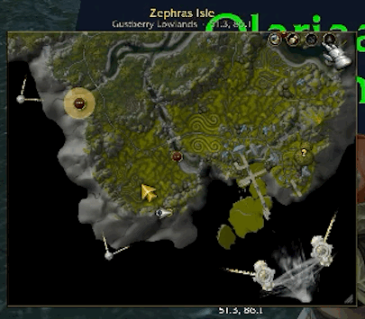

# MagicMap

A big, smooth, zoomable World of Warcraft map drawn from the game's own minimap terrain,
not the parchment world-map art. Built for WoW Forever; also runs on Classic Era,
Anniversary, MoP Classic and Retail.

**Status: alpha.** Expect rough edges. Please report anything odd, with a screenshot.

## Install

1. Download `MagicMap-<version>.zip` from [Releases](../../releases).
2. Unzip it into `World of Warcraft/<flavor>/Interface/AddOns/` (WoW Forever: `_classic_beta_`).
3. `/reload`, then open it with `/mm` or the minimap button.

## Features

**The map.** Every continent and instance at minimap detail, with smooth zoom from street level
out to the whole map.

**Any continent, any zone.** Pick a continent or instance from the title, then click a zone to fly
there. Zone and sub-zone borders and names are traced from the terrain itself.

Also drawn: the game's own **quest areas**, and **landmarks** you've used (vendors, trainers,
flight points and more).

**Minimap mode.** MagicMap takes your minimap's spot and zooms out far past it. Blizzard's
blips and other addons' pins (GatherMate, HandyNotes) still show on top, tooltips and all.

**World map takeover.** In minimap mode, M grows it into a big map, and M again shrinks it back.

**Follow a quest and path mode.** Click a quest to track it and make it your target (it gets a
gold halo). Path mode then keeps you and your target in view, with a faint line between you.

## Controls

| Do | How |
| --- | --- |
| Pan / zoom | Drag / mouse wheel |
| Pick a map | Click the title |
| Fly to a zone | Click it |
| Back to you | Right-click |
| Follow a quest | Click its icon or area |
| Waypoint | Ctrl-click (Ctrl-right-click clears) |
| Title-bar buttons | Follow, Path, Layers, Minimap mode |

Slash commands (`/mm`): `follow`, `map <name>`, `zone <name>`, `minimap`, `layers`, `icon`, `debug`, `reset`.

## How it works

- **Terrain.** Minimap tiles are ordinary textures an addon can draw by FileDataID. MagicMap
  lays them out on the 64×64 grid of 533⅓-yard tiles and places everything else in that grid.
- **Data, generated offline.** Perl tools in `tools/` read the game files from a local install
  or wago.tools: each map's WDT (which tile goes where), `Map.db2` (which maps exist), and the
  ADT terrain (area IDs and heights per 33-yard chunk). They write `Data/*.lua`: tile lists,
  zone borders and labels, and heights. At load, only the set for your client version is kept.
- **Everything else** is placed by world position through `C_Map`. Quest areas use the world
  map's own `QuestPOIFrame`.
- **Rendering.** Only visible tiles are drawn, from a pool. Wheel zoom eases toward a target.
  Pins and labels move as you zoom and are re-laid out once it settles. Borders (thousands of
  lines) are built a slice per frame into a hidden buffer, then cross-faded in.
- **Minimap mode** copies FarmHud's trick: `Minimap:SetAlpha(0)` hides Blizzard's terrain but
  not its blips. The real Minimap then moves into MagicMap's window, centred on you and sized
  so its yards-per-pixel matches our zoom, so its blips (and HereBeDragons pins) line up with our
  terrain. Buttons attached to the minimap move to a stand-in at its usual spot.

## Unknowns and risks

- **Barely tested in-game.** Most features were written without a Lua interpreter and checked
  only for syntax. Some code paths may simply be wrong.
- **Detail outside Forever.** Generated borders and heights exist only for WoW Forever. Other
  clients fall back to slower, rougher borders sampled at runtime, and have no height readout.
- **Minimap mode relies on undocumented behaviour:**
  - that `SetAlpha` on the Minimap hides only the terrain (FarmHud depends on this too);
  - HereBeDragons' internal pin table;
  - Blizzard frame names (e.g. `MinimapZoneTextButton`), which differ between clients.
  Another minimap addon (SexyMap, FarmHud, square-minimap addons) may conflict.
- **Blip range is the minimap's.** Blizzard's blips only cover about 230 yards around you, so
  zoomed far out, only MagicMap's own pins remain.
- **Rotate Minimap isn't supported**; minimap mode hands the minimap back while it's on.
- **Taint.** The world map takeover closes Blizzard's map from addon code (`HideUIPanel`).
  That could cause "action blocked" errors, especially in combat.
- **Instances and restricted positions.** Where the game withholds your position (many
  instances, some Retail contexts), following, path mode and minimap mode step aside.
- **Data drifts with patches.** Tile IDs and terrain change between game versions. The data
  files must be regenerated per client build, or tiles can be missing or wrong.

## Development

- `perl tools/luacheck.pl *.lua Data/*.lua`: Lua 5.1 syntax check (`--globals` lists globals per file).
- `perl tools/gen_tiles.pl local "/Applications/World of Warcraft" wow_classic_beta --heights Data/Heights_wow_classic_beta.lua > Data/Tiles_wow_classic_beta.lua`:
  regenerate tiles and heights (`wago <product>` pulls from wago.tools instead).
- `perl tools/gen_borders.pl "/Applications/World of Warcraft" wow_classic_beta > Data/Borders_wow_classic_beta.lua`:
  regenerate borders (~30 s).
- Release: set `## Version:` in `MagicMap.toc`, commit, tag `v<version>`, run `tools/package.sh v<version>`.
  This writes `dist/MagicMap-v<version>.zip`, without `tools/` or `docs/`.

## Credits

[wowdev](https://wowdev.wiki) for file-format docs and the community listfile;
[wago.tools](https://wago.tools) for build and file access.
