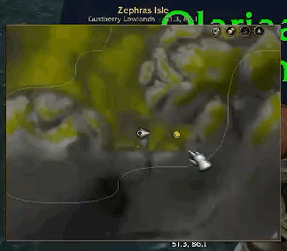
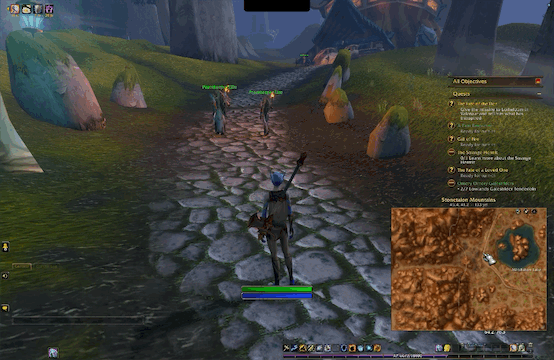
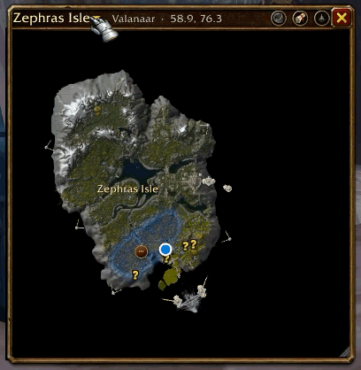
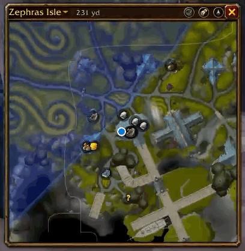

# MagicMap

Your minimap, but it zooms out to the whole world. MagicMap takes the minimap's spot and draws the
game's own minimap terrain at any zoom, from street level out to a whole continent, with
Blizzard's live blips (herbs, ore, tracked NPCs) still on it. Press M and it grows into a big map.
For WoW Forever only.

**Status: beta.** Expect a few rough edges. Please report anything odd, with a screenshot.

## Install

1. Download `MagicMap-v<version>.zip` from [Releases](../../releases).
2. Unzip it into `World of Warcraft/_classic_beta_/Interface/AddOns/`.
3. Restart the game (not just `/reload`: the addon's texture files only load at startup).
4. It takes your minimap's spot. `/mm` (or gear → Settings → Use Blizzard's minimap) gives
   Blizzard's minimap back, and `/mm` or the minimap button brings MagicMap back.

## Features

**The minimap.** MagicMap sits where your minimap was, square and framed, starting at about
200 yards across; the wheel takes it out as far as you like. Blizzard's blips and other addons'
minimap pins (GatherMate, HandyNotes) show on it, tooltips and all, while MagicMap draws its own
quests, flight points, points of interest, party members, corpse and waypoint. Move and resize it
anywhere; it remembers. Pan away and leave it, and it glides back to you after a few seconds.
Indoors it simply shows Blizzard's own minimap.



**M grows it into a big map** (so does the red button by the zone name), in the same frame, and
M, the button or Escape shrinks it back. The quest log (L) still opens Blizzard's world map.



**Every continent and instance**, at minimap detail. Pick one from the title, then click a zone to
fly there. Zone and sub-zone borders and names come from the terrain itself.





**Follow a quest, and path mode.** Click a quest's icon or area to make it your target (click
again to stop). Path mode then leans the view toward it with a faint line between you, and a gold
arrow on the map's edge when it's off the map; it heads for the nearest edge of a quest's area
and stands down once you're inside. It turns on by itself for a new target (a quest, a waypoint,
your corpse while you're a ghost) and never changes your zoom.

**The gear menu** (by the zone name, on hover):
- **Layers**, grouped into Map (zone labels, borders, unexplored shading), Quests (quests, their
  areas, quests to pick up), Places (flight points, dungeon entrances, graveyards, points of
  interest), People (party and raid, rares you've seen, live rares and treasures), You (corpse,
  waypoint), and one entry for each other addon whose world-map pins MagicMap shows (Questie,
  HandyNotes and others using HereBeDragons). Hover an entry for what it does.
- **Tracking**: Blizzard's minimap tracking (vendors, trainers, herbs...), which would
  otherwise be hidden along with the minimap's corner.
- **Settings**: the minimap button, tile colours, hiding Blizzard's copies of what MagicMap
  draws, resetting the position, and a few debug helpers.

## Controls

| Do | How |
| --- | --- |
| Pan / zoom | Drag / mouse wheel, or + / − at the map's bottom-right (on hover) |
| Move the window | Drag its title, or Alt-drag the map |
| Pick a map | Click the title |
| Fly to a zone | Click it (while more than one zone is in view) |
| Waypoint | Ctrl-click (Ctrl-right-click clears) |
| `/way` for a spot | Shift-click (puts it in chat) |
| Back to you, waypoint here, zone info | Right-click |
| Follow / path mode | Toggles at the map's bottom-left (on hover) |
| Big map | M, or the red button by the zone name (on hover) |
| Blizzard's minimap back | `/mm`, or gear → Settings |

Slash commands (`/mm` or `/magicmap`): on its own, MagicMap or Blizzard's minimap; `follow`, `path`, `map <name or id>`, `zone <name>`, `layers`, `landmarks` (how many
rares are remembered), `icon` (the minimap button), `reset` (back onto the minimap's spot), `tiles`, `debug`. For checking things in game: `perf` (records 10 seconds of real
use; `perf top` ranks MagicMap's CPU and memory against your other addons, `perf mem` splits its
memory into live and garbage), `sync` (Blizzard's minimap terrain over ours, to see whether its
blips line up; `sync full` to compare the two), `tint` (tile colour correction and coast fades)
and `dupes` (keep Blizzard's own markers alongside ours).

Settings are per character (`MagicMapDB`); remembered rares are shared by all your characters
(`MagicMapLandmarks`).

## How it works

- **Terrain.** Minimap tiles are ordinary textures an addon can draw by FileDataID. MagicMap
  lays them out on the 64×64 grid of 533⅓-yard tiles and places everything else in that grid.
- **Data, generated offline.** Python tools in `tools/` read the game files from a local install
  or wago.tools: each map's WDT (which tile goes where), `Map.db2` (which maps exist), and the
  ADT terrain (area IDs per 33-yard chunk). They write `Data/*.lua` for WoW Forever: tile lists,
  zone borders and labels.
- **Coasts, evened out.** The minimap art mixes bright shallow water with dark open sea, which
  showed as blue rectangles zoomed out. `tools/gen_tilecolor.py` reads the tiles' pixels and writes
  which tiles are open sea (not drawn), each coast tile's edge colour (faded outward), a few tile
  tints, and small water masks (`Textures/Water/`) that shade shallow water into the sea.
- **Everything else** is placed by world position through `C_Map`. Quest areas use the world
  map's own `QuestPOIFrame`.
- **Rendering.** Only visible tiles are drawn, from a pool. Wheel zoom eases toward a target.
  Pins and labels move as you zoom and are re-laid out once it settles. Borders (thousands of
  lines) are built a slice per frame into a hidden buffer, then cross-faded in.
- **The minimap takeover** does what Blizzard's own HybridMinimap does: `C_Minimap.SetDrawGroundTextures(false)`
  stops Blizzard's terrain but not its blips, and `C_Minimap.SetIgnoreRotateMinimap(true)` keeps it
  north up. The real Minimap then moves into MagicMap's window, centred on you and sized so its
  yards-per-pixel matches our zoom, so its blips (and HereBeDragons pins) line up with our
  terrain. The client doesn't clip it to the window, so a mask texture (`Textures/MinimapMask/`)
  confines its blips to the biggest square around you inside the window, and HereBeDragons pins
  move to a plain frame the window does clip. Blizzard's tracking for flight masters, quest
  objectives and points of interest is switched off meanwhile (we draw those) and restored after,
  and the rest of Blizzard's minimap cluster is hidden. Every change to Blizzard's minimap lives
  in `MinimapTakeover.lua`, paired with its undo; `MinimapBlips.lua` only decides where the
  Minimap goes each frame, and a test checks that leaving puts everything back exactly as it was.

## Unknowns and risks

- **Barely tested in-game.** Most features were written without the game at hand. They run
  headlessly in a simulated client in CI (see Development), which catches crashes, but not how
  things look or behave against the real client. Some code paths may simply be wrong.
- **Forever only.** The TOC, data and code target WoW Forever (a Retail-engine client) and
  nothing else; instances have no zone borders (one zone each).
- **The takeover relies on undocumented behaviour:**
  - that the Minimap without its ground textures draws nothing behind its blips (if it doesn't,
    the gear's Settings can switch back to FarmHud's trick, `SetAlpha(0)`);
  - HereBeDragons' internal pin table;
  - `C_Minimap.SetMinimapInsetInfo` pushing the rim arrows off screen (its arguments aren't documented);
  - Blizzard's default round mask texture, restored when MagicMap is hidden.

  Another minimap addon (SexyMap, square-minimap addons) may conflict. While FarmHud has the
  minimap, MagicMap leaves Blizzard's blips to it.
- **Blip range is the minimap's.** Blizzard's blips only cover about 230 yards around you, so
  zoomed far out, only MagicMap's own pins remain. They also step aside while zooming, and when
  zoomed in closer than Blizzard's closest minimap zoom.
- **Rotate Minimap**: inside MagicMap the minimap stays north up, like the map; other addons'
  minimap pins (HereBeDragons turns them with you) stay hidden while it's on.
- **Taint.** MagicMap hides Blizzard frames from addon code (the minimap cluster, and the
  world map when M grows MagicMap instead). That could cause "action blocked" errors, especially
  in combat.
- **Instances and restricted positions.** Where the game withholds your position (many
  instances), following shows the instance whole, and path mode and Blizzard's blips step aside.
- **Data drifts with patches.** Tile IDs and terrain change between Forever builds. The data
  files must be regenerated when they do, or tiles can be missing or wrong.

## Development

The tools need Python 3.9+. Generators use only the standard library (`gen_tilecolor.py
--preview` needs Pillow).

- `tools/check.sh`: everything CI runs (on pushes to main and on pull requests). It sets up a
  `.venv` with `tools/requirements-dev.txt` on first use (Lua 5.1 via `lupa`, and `pytest`), runs
  the Lua check, then the tests; pytest arguments pass through (`tools/check.sh -k minimap`).
- `.venv/bin/python tools/install.py _classic_beta_`: replaces the installed MagicMap in WoW
  Forever's folder with this working tree, after the Lua check; `/reload` to test (new texture
  files need a restart). The WoW folder defaults to the standard location; set `MAGICMAP_WOW` or
  pass `--wow` if yours is elsewhere.
- `tools/luacheck.py`: compiles every file in the TOC with a real Lua 5.1 and checks globals from
  the bytecode: a global write is a missing `local`, a read of anything not set by the addon or
  listed in `tools/wow_globals.txt` is likely a typo. `--globals` lists them per file.
- `tools/smoketest.py`: loads the addon in a simulated client (`tools/tests/wowsim.lua`: frames,
  layout, events, a mock world) and drives it through the scenarios in `tools/tests/scenarios.lua`,
  reporting every Lua error and failed expectation. It catches crashes and wrong API assumptions,
  not rendering or taint.
- `tools/bench.py`: drives the simulated client through rides, pans, a continent pan, a wheel zoom
  and the minimap on real Forever data, and reports per-frame Lua time, widget calls and frames
  where the view ran past the drawn zone borders. `--call-us 3` charges each widget call a
  client-like cost, so the time-sliced border builder takes as many frames as it would in game.
- The tests also run the generators end to end on a synthetic game install
  (`tools/tests/fixtures.py`) against golden output.
- Regenerate data from a local install (WoW Forever is the CASC product `wow_classic_beta`), in
  this order: `gen_tilecolor.py` reads `Data/Tiles.lua`, and rewrites `Textures/Water/` too.

  ```sh
  python3 tools/gen_tiles.py local "/Applications/World of Warcraft" wow_classic_beta -o Data/Tiles.lua
  python3 tools/gen_borders.py local "/Applications/World of Warcraft" wow_classic_beta -o Data/Borders.lua
  python3 tools/gen_tilecolor.py local "/Applications/World of Warcraft" wow_classic_beta -o Data/TileColor.lua
  ```

  `wago wow_classic_beta` works in place of `local INSTALL wow_classic_beta` (cached in
  `~/.cache/magicmap`, or `MAGICMAP_CACHE`), but `gen_tiles.py` then needs `--all-maps` to include
  instances. Borders are deterministic: the same game data always gives the same file.
  `tools/gen_minimap_masks.py` writes `Textures/MinimapMask/`, only needed if the mask sizes change.
- `tools/casc_extract.py` and `tools/db2dump.py` pull single files out of an install and dump
  `.db2` tables, for poking at game data.
- Release: set `## Version:` in `MagicMap.toc`, commit, tag `v<version>`, run `tools/package.sh v<version>`.
  This writes `dist/MagicMap-v<version>.zip`, without `tools/` or `docs/`.

## Credits

[wowdev](https://wowdev.wiki) for file-format docs and the community listfile;
[wago.tools](https://wago.tools) for build and file access.
